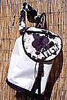

<HTML>  
<HEAD>
  <META NAME="GENERATOR" CONTENT="Adobe PageMill 3.0 Mac">
  <TITLE>FISH Power and Rubber Bouldering Site</TITLE>
</HEAD>
<BODY BACKGROUND="prpics/bg1.gif">

&nbsp;

<H2>
FISH Bouldering Store
(and more)
</H2>

for
maximum viewing pleasure, make your browser window the width of
this line 

<B>SEE OUR MAIN SITE
FOR CURRENT PRICES AND INFO. THIS PAGE IS OUT OF DATE AND NOT
BEING MAINTAINED .</B>

<B>Welcome to the FISH Bouldering
Store. No Portaledges or Haul Bags here...just the suave stuff
we make for bouldering and fun. To see the entire FISH line, go
to our other WWW site by clicking </B><A
HREF="http://www.fishproducts.com/" TARGET="_blank">HERE.</A>
Hope you like what you see and have a safe and fun time while
bouldering in the Bishop area.

<B>
MAXI PAD</B> 
Ok...here's how it happened. I've been using bouldering pads since
before the &quot;hogs done ate my little brother&quot;. The fatal
flaw has always been the depth Vs. support of the foam used inside
the pad. Nice big fluffy pads are great for short falls...cooshy!
On bigger falls the &quot;cooshy&quot; soon turn to ugly as you
either bottom out or twist your ankle deep in the foam. So, on
a recent trip to the boulders I found myself about 25 feet up,
pumped, getting worried, and unable to downclimb even a single
move.....I looked down at my &quot;cooshy&quot; pad. I though
of my ankles...I though of the rocks hiding under the pad....I
thought.....&quot;I need to make a new pad&quot;! I dropped like
a piano onto the &quot;cooshy&quot; and it kinda got gooshy. Yup,
bruised the ball of my foot and half twisted my ankle. I called
up the biggest foam company in the U.S. when I got back to the
office and made an appointment. After a lovely factory tour we
got down to business. They got me on the right track with more
foam info than one man should posess. Seems the only guys who
have had it right all these years were gymnasts. They bop onto
pads all day long, feet first. Think dense foam. We have incorporated
this idea of dense foam into our Maxi Pad. The Maxi Pad is about
2.5&quot; thick and even has a full length zipper so you can quickly
adjust your density to suit your needs. The Maxi Pad has an easy
carry suspension system that goes from backpack style to an over
the shoulder model in seconds. The fold over is not hinged, so
when the pad is open you have the full value of the entire pad
to bomb onto...no seams to ruin your day. The bottom fabric of
the pad is an extremely durable VCN nylon (like our Beef Bags),
which has the added advantage of &quot;sticking&quot; to slabs
and funny angles better than Cordura or other nylons. In the FISH
tradition for excess, we made the Maxi Pad close to a full 4 feet
X 5 feet. Yup, 4 X 5. Miss that! Overkill construction, peerless
durability, and a remote foot wiping swath make this pad the best
available, and far and away the best value. You can also order
the Maxi Pad without any foam. The empty version is nice if you
want to use the Maxi Pad for a home wall and you just need a nice
big sack to contain all your &quot;cooshy&quot; scraps.  
<B>FISH Maxi-Pad</B>, empty: <B>SOLD OUT 
FISH Maxi-Pad</B>, ready to bop: <B>SOLD OUT</B>

<B>See the MaxiPad in action on the Volcanic Tablelands
near Bishop, Ca. by clicking <A HREF="prpics/farmertan.jpeg">here</A>,
or <A HREF="prpics/scoop.jpeg">here</A>.</B>

<B>FISH MINI-PAD</B> 
A smaller version of our Maxi Pad. The Mini-Pad is not as small
as it sounds, logging in at a modest 36&quot; X 48&quot; and has
the same features including the padding and carry system as the
Maxi Pad. Good all around choice for a nice pad at a low price.
 
<B>Mini-Pad, SOLD OUT</B>

<STRONG>dasBOOT: 
</STRONG>
(Available in Mystery Bovine and Zebra only) 
Here's a fun boot carrier that will help you climb better by up
to 8 letter grades! Sounds like hype, don't it? Well, let me break
it down this way: You are out cragging and as usual your boots
are floating around loose in your pack. You have a seat to BS
with some neophytes at the base of your favorite &quot;wired&quot;
problem. With a cocksure nonchalance you offer to show them the
&quot;sequence&quot;. Smug as can be you pull out your boots and
they are covered with squished prunes resulting from your impromptu
seat. Rats! Now the kids are razzing you and calling ya &quot;pops&quot;
as you try to wipe your boots clean. Never would have happened
if you had our dasBoot. Shampelt top panel lets the stink out,
420 denier pack cloth keeps the bottom intact. A grab loop and
cinch closure finish the masterpiece. Remember: Clean rubber sticks
better. Try it sometime. <STRONG>$21.00 ea.</STRONG>

<B>Bingo's
Booze Muffler</B>, 3/8&quot; closed cell foam and suave pelts
will keep the cold ones cold. The Muffler sports an adjusting
wrap around design that fits most cans and bottles with ease,
and looks 
oh-so-good in your palm. Various pelts. <B>$6.75 ea</B>.

 <B>Fish Lids</B>,
whether you need a rug, or just want to keep the sun out of your
eyes. Tasteful two tone with a big fat FISH logo right on the
front. Adjustable to fit most heads. <B>$15.00</B>

 

&nbsp;

<STRONG>Gobie Kit:</STRONG> 
Get ready for bouldering season with this human repair and injury
prevention kit. Each kit comes with two rolls of the finest cloth
tape (1.5&quot; wide x 15yds. long) and a 2oz bottle of Benzoin
Tincture. Not only does the Benzoin make the tape stick like mad,
but it doubles as hardman perfume. Complete with instructions
on human repair and taping techniques of the stars. <STRONG>SOLD
OUT</STRONG>

<STRONG>Tincture:</STRONG> If you already have a supply of
tape, just order the Tincture and we'll throw in the &quot;Taping
Tips&quot; for free. <STRONG>SOLD OUT ea.</STRONG>

<STRONG>Chalk:</STRONG> 
Available by the pound only. That's 8 blocks for those that are
counting. Genuine Endo Block. None finer! <STRONG>SOLD OUT</STRONG>

<STRONG>Chalk
Bags:</STRONG> 
We feature two chalk bags that have the wildest patterns in any
arena. Think of the craziest Hawaiian shirt ever witnessed, exotic
pelts, maybe brash prints --- sometimes even Elvis. Now, what
if you had these on your chalk bag? You'd be stoked, right? Well
here you go --- The &quot;Fist&quot; model is 7&quot; tall with
a 5.5&quot; bottom, and the &quot;Palm&quot; model is 5&quot;
tall with a 5&quot; bottom. Both bags feature a &quot;best of
both worlds&quot; stay open rim that has non-kinking cable sewn
in with numerous rows of stitching. Features a collar closure
and our uniqe pile &quot;ligament&quot; inside the bag, plus there
is a toothbrush holder for crag maintenance. An easy way to order
is to ask for &quot;wild&quot; or &quot;mild&quot; and then pick
a color theme.<STRONG>SOLD OUT</STRONG>

<A HREF="prpics/wtlung.jpeg" TARGET="_self"><B></B></A><B>White Lung Chalk Bag:</B> 
A big volcano shaped bag that will hold tons of chalk...ok, maybe
more like 5 blocks. Great for the home gym or those with extra
sweaty palms. Pick the &quot;wild&quot; or &quot;mild&quot; versions
as above. <B>SOLD OUT </B>

<STRONG>Chalk Bag Belts:</STRONG> Made from 3/4&quot;
flat nylon webbing. Features a no-slip Fastex buckle. 
One size fits all. <STRONG>$4.25 ea.</STRONG>

<STRONG>Pro
Bag:</STRONG> Our &quot;Pro Bag&quot; is one sharp piece of luggage.
We have put overkill construction methods into the world of high
fashion. The result is a totally bomber duffel bag, suave as can
be, that can hold a complete rack, rope, shoes, food, and still
have enough room for a $3.00 bottle of &quot;Thunderbird&quot;.
The main body features heavy weight Ballistic Cloth in black,
or for that sanitary look, our bomber White Vinyl haul bag fabric.
The carry handles are made from 2&quot; seatbelt webbing with
a 1&quot; tubular sleeve on the carry area. For the fashion kicker,
we put eye poppin' fur animal prints on the 12&quot; diameter
end pieces. The short hair prints are your choice of Zebra, Dalmatian,
Mystery Bovine, and Ocelot. Holy cow! You've got to see it to
believe it. 12&quot; diameter ends, 21&quot; long. 2300 cu. in.
<STRONG>$36.00 ea.</STRONG>

<A HREF="../pics/b1pack.jpeg" TARGET="_self"><B></B></A><B>B-1
and B-2 Bouldering Pack: 
</B>
The B-1 is a lightweight shoulder pack designed for carrying your
boots, chalk bag, and maybe some water and snacks while bouldering.
The pack body is our ONS Mesh, an extremely tough and durable
fabric that is light in weight and since it is a mesh, lets your
boot stink escape into the atmosphere instantly. A single over
the shoulder strap is provided and is lightly padded with ShamPelt
fur. The top pocket has an outside zipper so you can get to your
tape and tincture before your flapper makes you bleed to death.
The bottom is made from 18oz. VCN fabric for long life. Approximate
size is 2000 cu.in. with a 12&quot; diameter bottom. <B>SOLD OUT</B> 
If you would prefer a more tradtional set up, order the <B>B-2
Bouldering Pack</B>, which has all the features of the B-1, but
comes with two shoulder straps instead of the single strap for
over the shoulder <I>chic</I>.SOLD OUT

<B>Crag Pack (just in!!!!) 
</B>Here is the scoop on these packs.... we were approached
by a MAJOR pack manufacturer to order a run of packs using their
VAST resources. Hmmmmm...... sounded pretty good to me, but all
the samples they had were not exactly what we were looking for.
After a few trial runs and some changes for the better, we were
presented with a 35 litre (that's a lot of beer!) pack with that
&quot;all pro, $125.00 look&quot; that you see in the stores.
Their factory has been making packs for the big name (and big
$$$$) companies for a long time, and the workmanship and features
on this pack shout &quot;pay big bucks!!!&quot;. But, since we
have no middleman, instead of getting the reamer for around $100.00
or more, we can offer these at a great intro price of only $69.00.
This price will be going up to $79.00 in the future, so order
now. Click on a small photo to see all the features. A few highlights:
burly Diamond Grid Cordura body fabric, internal stays, molded
back panel, top and bottom zipper openings, numerous lash straps,
and a &quot;wet or stinky&quot; mesh pocket on the outside rear
of the body. All the packs are dark green and black. <B>SOLD OUT</B>.

<A HREF="../pics/packpics/packcontents.jpeg" TARGET="frame9330"> </A>

<STRONG>ORDERING INFO</STRONG>

<STRONG>Ordering by mail:</STRONG> Enclose a personal check
(no rubber ones) a moneyorder, or your Credit Card information
for the full amount. CA residents must add 8.25% sales tax. Include
a phone number in case we need to contact you about your order.
Be sure to write very clearly fer we is kinda dumb. <B>Send to
Fish Products, P.O. Box 1507, Bishop, Ca. 93515</B>

<STRONG>Phone Orders / Fax Orders / Email Orders:</STRONG>
You can call, fax, or Email your order 24 hours a day. 
The above methods of ordering will be accepted for C.O.D. or Credit
Card purchases only. Payment for C.O.D. orders MUST be by CERTIFIED
CHECK or MONEY ORDER. Plan ahead, for when the UPS Man cometh,
he will be looking for either of these. NO EXCEPTIONS! <B>Call
us at 760.387.2120</B>

<STRONG>Will Call / Pick Up:</STRONG> We don't not encourage
or allow &quot;on site pick ups&quot;. If you live two blocks
away, and beg - maybe. Random mystery flybys are a no-no, so don't
even ask unless your very life depends on it - and you have a
note from your doctor. But, on the other hand, if you are in town
and need a MaxiPad real bad.....we could meet you at the Pub or
even at the boulders. Try to arrange this well in advance of your
visit. Email is best.

<STRONG>Shipping:</STRONG> We prefer to ship by UPS if possible.
We will need a street address for UPS deliveries. We have adopted
a flat rate for shipping. Here's how it works: CA residents, 4%
of order total, with a <STRONG>$5.00 minimum and a $15.00 maximum.</STRONG>
All other states, 8% of order total, with a <STRONG>$6.00 minimum
and a $20.00 maximum.</STRONG> Rush shipping is available at an
additional cost. Call us for pricing on 2nd Day Air and Next Day
Air. NOTE: all MaxiPad and MiniPad shipping charges will carry
an extra $5.00 to $9.00 in shipping charges. These pads are oversize
and require more handling by U.P.S.

<STRONG>Returns:</STRONG> If you are not completely satisfied
with any item purchased from us, simply return said item in <B>original</B>
condition for a replacement, exchange, or FULL refund. This refund
will <B>not</B> include the shipping charges.

<STRONG>Back Orders: </STRONG>Sometimes an item you order will
be out of stock or backordered. If this happens, and we can not
ship your entire order within a reasonable amount of time, we
will notify you of the delay. To reduce the chance of any shipping
delay of your order, include second color choices, other options,
etc. If you have a deadline, let us know and we will bust our
ass to meet it. We know how it is to leave on a trip without a
much needed piece of gear _ it sucks!

<STRONG>International Orders:</STRONG> Payment for your order
can be sent directly to us by International Money Order or by
Credit Card. Call, Email or fax us for more information. If you
are in Canada, Email us for a listing of your local dealers or
distributors.

<TABLE BORDER="1" WIDTH="550" CELLSPACING="2" CELLPADDING="0">
  <TR>
    <TD ALIGN="CENTER"><STRONG>ORDERING TIPS:</STRONG> Always include
      a phone number. Always include a deadline date for when you must
      have the goods. List substitutes for colors, options, etc. Try
      to order the gear you are going to need as early in your trip
      planning as possible. Plan ahead for maximum product enjoyment.</TD> 
  </TR>
</TABLE>

<B>Ready? Email us your order now! 
<A HREF="mailto:info@fishproducts.com?subject=Bouldering Stuff Order">ORDER</A></B>

Back to the
<A HREF="{{ "/archive/bouldering" | prepend: site.baseurl }}" TARGET="_top">Power and Rubber home</A> page

Problems or comments? Send your vibe to <A HREF="mailto:webmaster@fishproducts.com?subject=Webmaster"
TARGET="_blank">webmaster@FishProducts.com</A>

</BODY>
</HTML>
